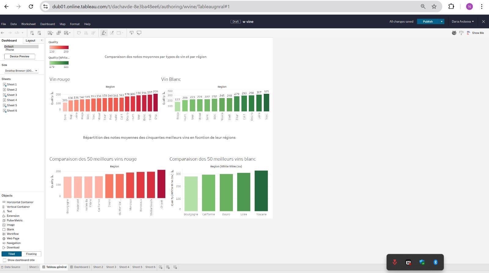
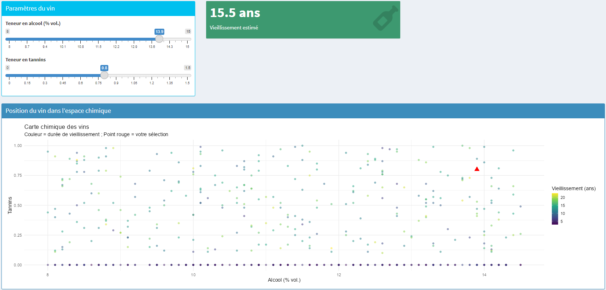
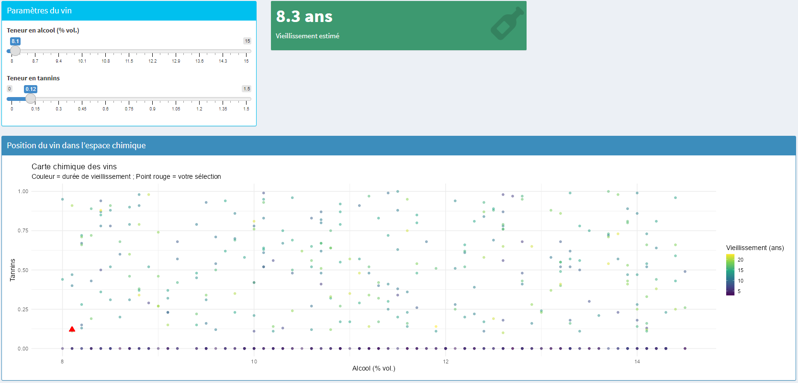
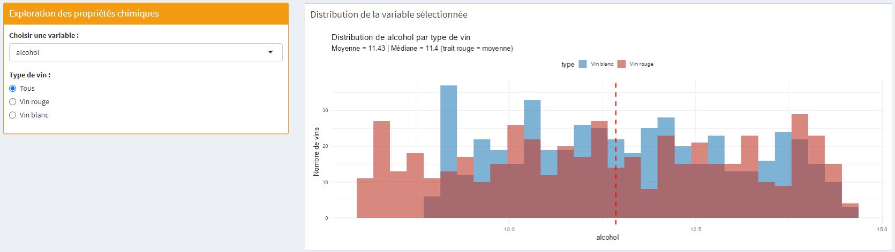

```{r include=FALSE}
library(ggplot2)
library(dplyr)
library(tidyr)
```

# Introduction
MorpheUTT fait référence au personnage Morpheus de la saga Matrix, faisant également référence aux vecteurs et surtout matrices que l'on manipulera pendant le projet. La terminaison UTT est pour l'école !

Dans le cadre de ce projet, nous avons choisi d'utiliser deux jeux de données portant sur la qualité des vins : l'un sur le vin rouge (red_wine.csv), l'autre sur le vin blanc (white_wine.csv).
Ces données sont issues d’une étude menée par l'Université de Minho (Portugal) et sont accessibles publiquement sur plusieurs plateformes de data science. Elles ont été collectées afin de prédire la qualité des vins à partir de leurs propriétés physico-chimiques.

Les deux fichiers contiennent les observations suivantes :

    Vin rouge :
        Nombre de variables : 21

    Vin blanc :
        Nombre de variables : 21
  
# Description des variables

| Variable                 | Description                                                       | Type                |
|--------------------------|-------------------------------------------------------------------|---------------------|
| `nom_du_vin`             | Nom commercial du vin                                             | Nominal             |
| `region`                 | Région viticole d'origine (ex : Toscane, Bordeaux, Napa Valley)   | Catégorique         |
| `cepage`                 | Type de raisin utilisé (ex : Cabernet Sauvignon, Malbec)          | Catégorique         |
| `annee`                  | Année de production du vin                                        | Numérique (discret) |
| `prix_eur`               | Prix du vin en euros (€)                                          | Numérique (continu) |
| `type_vin`               | Type de vin (rouge, blanc)                                        | Catégorique         |
| `fixed acidity`          | Quantité d'acide fixe présent dans le vin                         | Numérique (continu) |
| `volatile acidity`       | Quantité d'acide volatile (influence l'arôme)                     | Numérique (continu) |
| `citric acid`            | Quantité d'acide citrique (donne de la fraîcheur)                 | Numérique (continu) |
| `residual sugar`         | Teneur en sucre résiduel après fermentation                       | Numérique (continu) |
| `chlorides`              | Teneur en chlorure du vin                                         | Numérique (continu) |
| `free sulfur dioxide`    | Dioxyde de soufre libre (protège contre la dégradation)           | Numérique (continu) |
| `total sulfur dioxide`   | Quantité totale de dioxyde de soufre                              | Numérique (continu) |
| `density`                | Densité du vin, liée à l'alcool et au sucre                       | Numérique (continu) |
| `pH`                     | Mesure de l'acidité du vin (sans unité, entre 0 et 14)            | Numérique (continu) |
| `sulphates`              | Teneur en sulfates (contribue à la conservation et au goût)       | Numérique (continu) |
| `alcohol`                | Teneur en alcool (% vol.)                                         | Numérique (continu) |
| `quality`                | Note de qualité du vin (entre 0 et 10), attribuée par des experts | Numérique (discret) |
| `temperature_service`    | Température idéale de dégustation (°C)                            | Numérique (continu) |
| `tannins`                | Indice de teneur en tannins (impacte l'astringence du vin)        | Numérique (continu) |
| `vieillissement_optimal` | Durée recommandée de vieillissement avant consommation            | Numérique (discret) |
| `quality`                | note de qualité du vin attribuée par des dégustateurs (de 0 à 10) | Numérique (discret) |


# Plan d’analyse

L'objectif de notre analyse est d'explorer les relations entre les propriétés physico-chimiques des vins et leur **qualité**. Nous souhaitons répondre aux questions suivantes :

1) Quelle-est la température idéale de dégustations pour un vin rouge et un vin blanc ?
2) Existe-t-il une forte corrélation entre certaines propriétés chimiques et la qualité du vin ? Y a-t-il des différences significatives entre les vins rouges et les vins blancs en termes de caractéristiques et de qualité ? Peut-on identifier les variables qui influencent le plus la qualité du vin ?
3) Comment se répartissent les types de cépages (catégorie : cépage) en fonction des régions viticoles (région) ?
4) Comment la qualité des vins rouges et blancs a-t-elle évolué entre 2010 et 2022 et peut-on identifier des années particulièrement favorables ou défavorables à la qualité du vin ?
5) Quel est le profil chimique moyen des excellents vin (>8)


## 1) Quelle-est la température idéale de dégustations pour un vin rouge et un vin blanc ?


```{r include=FALSE}
redwine <- read.csv("~/projet-if36-p25-morphe-utt/data/red_wine.csv", header = TRUE, sep = ';')
whitewine <- read.csv("~/projet-if36-p25-morphe-utt/data/white_wine.csv", header = TRUE, sep = ';')

variables_chimiques <- c("fixed_acidity", "volatile_acidity", "citric_acid",
              "residual_sugar", "chlorides", "free_sulfur_dioxide",
              "total_sulfur_dioxide", "density", "pH", "sulphates", "alcohol")

unit_labels <- c(
  "fixed_acidity"         = "Acidité fixe (g/dm³)",
  "volatile_acidity"      = "Acidité volatile (g/dm³)",
  "citric_acid"           = "Acide citrique (g/dm³)",
  "residual_sugar"        = "Sucre résiduel (g/dm³)",
  "chlorides"             = "Chlorures (g/dm³)",
  "free_sulfur_dioxide"   = "SO2 libre (mg/dm³)",
  "total_sulfur_dioxide"  = "SO2 total (mg/dm³)",
  "density"               = "Densité (g/cm³)",
  "pH"                    = "pH",
  "sulphates"             = "Sulfates (g/dm³)",
  "alcohol"               = "Alcool (% vol.)"
)

redwine2 <- redwine %>%
  select(quality, all_of(variables_chimiques)) %>%
  pivot_longer(
    cols = all_of(variables_chimiques),
    names_to  = "variable",
    values_to = "valeur"
  )

# Ajout d'une colonne type_vin pour identifier les deux jeux de données
redwine$type_vin <- "Rouge"
whitewine$type_vin <- "Blanc"

# Fusion des deux datasets
wine <- bind_rows(redwine, whitewine)

```

```{r echo=FALSE}
# ================= VISUALISATION ================= 

# Les boites à moustache
ggplot(wine, aes(x = reorder(region, temperature_service, FUN = median), y = temperature_service, fill = type_vin)) +
  geom_boxplot(outlier.alpha = 0.3) +
  coord_flip() +
  scale_y_continuous(breaks = seq(5, 20, by = 1)) +  # axe Y = température plus détaillé
  theme_minimal(base_size = 12) +
  scale_fill_manual(values = c("Rouge" = "firebrick", "Blanc" = "steelblue")) +
  labs(
    title = "Température idéale de dégustation par région et type de vin",
    x     = "Région viticole",
    y     = "Température idéale de service (°C)",
    fill  = "Type de vin"
  )
```

### Conclusion :
Voici ce que nous pouvons remarquer sur ce graphique. Tout d’abord les vins rouges et les vins blancs ne se dégustent pas à la même température. Les vins blancs se dégustent à une températures plus fraîche, entre 6 et 12 degrés, tandis que les vins rouges se situent sur des températures plus hautes, et sur une échelle plus large entre 8 et 18 degrés. Essayons de voir si nous pouvons préciser cette analyse. Si nous regardons plus en détail les boîtes à moustache des vins rouges, on peut voir que leurs médianes sont rarement au même endroit, comparé à celles des vins blancs. On peut en conclure que la température de dégustation des vins rouges dépend beaucoup plus de la région où le vin est produit et stocké, car les températures ont tendance à plus être dans un quartile supérieur ou inférieur comparé à une répartition 50% pile poile. C’est une analyse qui est normale, car la médiane est trouvée par région donc on peut se dire qu’elle changera forcément mais si on analyse les vins blancs, la médiane tourne quasiment à 50% des vins produits autour des 9 degrés. Ce qui n’est clairement pas le cas pour les vins rouges.

Nous pouvons alors répondre à la question de la manière suivante. Il n’y a en réalité pas de température précise de dégustation qui se dégage pour chaque type de vin. On peut être un peu plus précis en donnant une échelle de température pour nos deux types de vins, en expliquant que les vins blancs se dégustent plus frais que les vins rouges, mais il nous est impossible d’exprimer une température donnée, car elles dépendent trop de comment, dans une région, le vin est produit et stockés.


## 2) Existe-t-il une forte corrélation entre certaines propriétés chimiques et la qualité du vin ? Y a-t-il des différences significatives entre les vins rouges et les vins blancs en termes de caractéristiques et de qualité ? Peut-on identifier les variables qui influencent le plus la qualité du vin


```{r include=FALSE}
red_wine <- read.csv("~/projet-if36-p25-morphe-utt/data/red_wine.csv", header = TRUE, sep = ';')
white_wine <- read.csv("~/projet-if36-p25-morphe-utt/data/white_wine.csv", header = TRUE, sep = ';')

names(red_wine) <- tolower(names(red_wine))
names(white_wine) <- tolower(names(white_wine))

setdiff(names(red_wine), names(white_wine))
setdiff(names(white_wine), names(red_wine))

red_wine$type_vin <- "rouge"
white_wine$type_vin <- "blanc"

red_wine$mineralite <- NA
white_wine$tannins <- NA

red_wine <- red_wine[, names(white_wine)]

vin_total <- rbind(red_wine, white_wine)
```


```{r echo=FALSE, message=FALSE, warning=FALSE, error=FALSE}
library(tidyr)

vin_long <- vin_total %>%
  pivot_longer(cols = c(fixed_acidity, volatile_acidity, citric_acid,
                        residual_sugar, chlorides, free_sulfur_dioxide,
                        total_sulfur_dioxide, density, sulphates,
                        alcohol, temperature_service, mineralite),
               names_to = "variable",
               values_to = "valeur")

ggplot(vin_long, aes(x = as.factor(quality), y = valeur, color = type_vin)) +
  geom_smooth(method = "lm", se = TRUE, linetype = "solid", size = 3, 
              aes(group = type_vin, color = type_vin, fill = type_vin)) + 
  facet_wrap(~ variable, scales = "free_y") +
  labs(
    title = "Comparaison des caractéristiques selon la qualité du vin",
    subtitle = "Analyse de la qualité du vin blanc et rouge",
    x = "Qualité du vin (0-10)",
    y = "Valeur mesurée",
    color = "Type de vin"
  ) +
  scale_color_manual(values = c("rouge" = "#D32F2F", "blanc" = "#388E3C")) +
  scale_fill_manual(values = c("rouge" = "#D32F2F", "blanc" = "#388E3C")) +
  theme_minimal()
```

Oui, il existe des différences significatives entre les vins rouges et les vins blancs en termes de caractéristiques et de qualité. 

Caractéristiques chimiques :

**Alcool :** Les vins blancs ont en moyenne un taux d’alcool plus élevé que les rouges. Pour les blancs, une augmentation du taux d’alcool est associée à une meilleure qualité, alors que c’est l’inverse pour les rouges.
Chlorures : Les vins rouges contiennent davantage de chlorures que les blancs. Pour les rouges, une teneur plus élevée en chlorures est liée à une meilleure qualité, ce qui n’est pas le cas pour les blancs.

**Acide citrique :** Plus présent dans les blancs que dans les rouges. Dans les deux types de vins, une qualité supérieure est associée à une baisse de la teneur en acide citrique. 
Densité : Les rouges sont plus denses que les blancs. La densité influence la qualité des rouges, mais pas celle des blancs. 

**Acidité fixe :** Environ deux fois plus élevée dans les rouges que dans les blancs. Dioxyde de soufre total : Plus présent dans les blancs. Dans les rouges, une augmentation est corrélée à une meilleure qualité. Minéralité : Présente uniquement dans les blancs, sans lien clair avec la qualité. 9 Sucres résiduels : Plus élevés de 25 % dans les blancs que dans les rouges. Dans les deux cas, une baisse des sucres est associée à une meilleure qualité. 

**Sulphates :** Plus présents dans les rouges. Leur légère augmentation améliore la qualité des rouges, tandis que dans les blancs, leur diminution est corrélée à une meilleure qualité. 

**Dioxyde de soufre libre :** Plus abondant dans les blancs. Sa diminution est associée à une amélioration de la qualité dans les blancs, mais elle n’influence pas la qualité des rouges. Acidité volatile : Plus présente dans les rouges. Sa baisse est liée à une amélioration de la qualité pour les rouges, alors que pour les blancs, c’est sa hausse qui semble bénéfique. Température de service : Les vins rouges sont servis en moyenne 4°C plus chauds que les blancs.


Ainsi, existe une forte corrélation entre certaines propriétés chimiques et la qualité du vin, mais cette corrélation varie selon qu’il s’agisse de vin rouge ou blanc. Par exemple, un taux d’alcool plus élevé améliore la qualité des blancs, mais la dégrade pour les rouges. De même, une faible teneur en sucres résiduels ou en acide citrique est généralement associée à une meilleure qualité dans les deux types de vin.
 Les rouges sont en moyenne plus denses, plus acides et plus riches en sulphates et chlorures, tandis que les blancs présentent une plus grande teneur en dioxyde de soufre, en sucres et en minéralité. 
Certaines variables influencent fortement la qualité selon le type : l’acidité volatile doit être basse pour un bon vin rouge, mais plus élevée pour un bon blanc, et les sulphates ont un effet opposé selon le type de vin. 
Ces différences chimiques marquées permettent donc d’identifier les facteurs les plus déterminants dans l’évaluation de la qualité, tout en soulignant que les critères varient selon la couleur du vin.

``` {r echo=FALSE, message=FALSE, warning=FALSE, error=FALSE}

```

### Analyse :

Quand on regarde les graphes faits précédemment sur tableau, nous pouvons relever plusieurs tendances.

    Pour les blancs, la Toscane, la Loire, le Douro et la Californie décrochent les meilleures notes.

    Côté rouges, ce sont surtout le Chianti, Stellenbosch, Bordeaux et Mendoza qui se démarquent.
        
**__Comment justifier cela ?__**

Commençons par nous pencher sur les variables climatiques. Ces endroits profitent souvent d’un équilibre parfait entre soleil et fraîcheur, ce qui permet aux raisins de bien mûrir tout en préservant leur acidité et leurs arômes. 
  
  - Pour ce qui est **du bordeaux**, la région bénéficie d’un climat tempéré et humide notamment grâce à la présence de nombreux littoraux. La région se situe au croisement entre la Dordogne, la Garonne et la Gironde ce qui influence grandement le climat de la région évitant notamment les grandes variations de température, provenant du gel et des fortes chaleurs.
  
La qualité du sol joue également un rôle important dans la qualité du vin.

  - **La Loire** produit notamment du bon vin blanc non seulement grace à son climat tempéré, mais cela peut aussi ce justifié par la qualité de ces terres. La forte présence de Calcaire et de d'argile représente un grand atout dans la pousse du raisin, lui offrant un caractère particulier
  
  - **En Bourgogne** ou dans la Loire, les terres riches en minéraux donnent des vins pleins de finesse et de fraîcheur. 
  
  - **Stellenbosch**, en Afrique du Sud, peut compter sur des sols anciens et variés pour produire des rouges très expressifs.
  
Le savoir-faire transmis depuis des générations dans des régions comme Bordeaux ou le Piémont joue aussi un rôle clé. C’est cette expérience, mêlée à l’innovation, qui permet d’atteindre et de maintenir une telle qualité.

Enfin, le choix du cépage joue un rôle important dans le processus de création du vin. Chaque région a su trouver le raisin qui s’exprime le mieux sur son territoire. La Loire continue d’impressionner avec son Sauvignon blanc, la Toscane ne serait rien sans le Sangiovese, et la Californie brille avec le Chardonnay ou le Cabernet Sauvignon. Ce mariage réussi entre cépage et territoire explique aussi la régularité des grands vins. Ainsi, certaines régions sont favorisées dans la création de vins de qualité. 

En résumé, si certaines régions produisent les meilleurs vins c’est grâce à un ensemble de conditions qui permettent un équilibre favorisant la pousse d’un bon raisin. Certaines régions bénéficient d’un climat idéal, de terroirs remarquables, d’une vraie tradition et d’un savoir-faire précieux et cette différence peut se remarquer de façon géographique.


## 3) Comment se répartissent les types de cépages (catégorie : cépage) en fonction des régions viticoles (région) ?


```{r include=FALSE}
knitr::opts_chunk$set(echo = TRUE, warning = FALSE, message = FALSE)
library(tidyverse)
library(ggplot2)
library(GGally)
library(readr)
library(leaflet)
library(dplyr)
library(tibble)
library(ggcorrplot)

# Chargement des fichiers CSV
red_wine <- read_delim("~/projet-if36-p25-morphe-utt/data/red_wine.csv", delim = ";", locale = locale(encoding = "ISO-8859-1"))
white_wine <- read_delim("~/projet-if36-p25-morphe-utt/data/white_wine.csv", delim = ";", locale = locale(encoding = "ISO-8859-1"))

# Colonnes communes
common_cols <- intersect(colnames(red_wine), colnames(white_wine))

# Ajout du type de vin
red_wine_common <- red_wine %>% select(all_of(common_cols)) %>% mutate(type = "Rouge")
white_wine_common <- white_wine %>% select(all_of(common_cols)) %>% mutate(type = "Blanc")

# Fusion des jeux de données
wine_combined <- bind_rows(red_wine_common, white_wine_common)

regions_fr <- tibble(
  region = c("Alsace", "Bordeaux", "Bourgogne", "Loire", "Vallée du Rhône"),
  lon = c(7.5, -0.58, 4.84, 0.7, 4.8),
  lat = c(48.5, 44.8, 47.0, 47.4, 45.0)
)

dot_data <- wine_combined %>%
  filter(region %in% regions_fr$region) %>%
  group_by(region, cepage) %>%
  summarise(n = n(), .groups = "drop") %>%
  left_join(regions_fr, by = "region")

# Placement circulaire des cépages autour de chaque région

dot_data <- dot_data %>%
  arrange(region, cepage) %>%
  group_by(region) %>%
  mutate(
    idx = row_number(),
    total = n(),
    angle = 2 * pi * (idx - 1) / total,
    offset = 0.4,
    lon_jitter = lon + offset * cos(angle),
    lat_jitter = lat + offset * sin(angle),
    radius = pmax(sqrt(n) * 3, 6)
  ) %>%
  ungroup()
```


```{r echo=FALSE}
cepages <- unique(dot_data$cepage)
colors <- colorFactor(rainbow(length(cepages)), domain = cepages)

leaflet(dot_data) %>%
  addProviderTiles(providers$CartoDB.Positron) %>%
  addCircleMarkers(
    ~lon_jitter, ~lat_jitter,
    color = ~colors(cepage),
    radius = ~radius,
    fillOpacity = 0.85,
    label = ~paste0(
      "<b>Région :</b> ", region,
      "<br><b>Cépage :</b> ", cepage,
      "<br><b>Occurrences :</b> ", n
    ),
    labelOptions = labelOptions(direction = "auto")
  ) %>%
  addLabelOnlyMarkers(
    data = regions_fr,
    lng = ~lon, lat = ~lat + 0.5,
    label = ~region,
    labelOptions = labelOptions(noHide = TRUE, direction = 'top',
                                textOnly = TRUE, style = list(
                                  "font-weight" = "bold",
                                  "font-size" = "13px",
                                  "color" = "black"
                                ))
  ) %>%
  addLegend("bottomright", pal = colors, values = ~cepage,
            title = "Cépages détectés", opacity = 1)
```


**__Interprétation détaillée de la carte interactive des cépages par région viticole__**

La carte présentée offre une visualisation géographique intuitive des différents cépages (variétés de raisins) répertoriés dans cinq grandes régions viticoles françaises : Bordeaux, Bourgogne, Vallée du Rhône, Loire et Alsace. Voici une analyse approfondie des informations qu'elle met en évidence :

**Diversité des cépages**

  - Chaque couleur représente un cépage distinct, ce qui permet d'apprécier visuellement la diversité au sein de chaque région.
  
  - La **Loire** et la **Bourgogne** apparaissent comme les régions avec la plus grande diversité de cépages, illustrée par une large gamme de couleurs.
  
  - À l'inverse, des régions comme **Bordeaux** ou **Vallée du Rhône** semblent avoir une palette un peu plus restreinte mais bien spécifique, ce qui peut témoigner d'une spécialisation qualitative sur quelques variétés.

**Concentration par région**

  - La taille des bulles est proportionnelle au nombre d'occurrences des cépages :

    - En **Loire**, les cépages prédominants sont très fortement implantés, ce qui traduit une importante production ou une prédominance de certaines variétés.

    - **Alsace** et **Bourgogne** montrent une bonne répartition de plusieurs cépages avec des tailles de bulles relativement homogènes, indiquant une culture régulière de plusieurs types.
    
**Portée géographique**

  - On remarque que certains cépages comme le **Pinot Noir**, le **Chardonnay** ou le **Sauvignon Blanc** apparaissent dans plusieurs régions, montrant leur adaptabilité à différents terroirs.
  
  - D'autres cépages sont clairement localisés, comme le **Sylvaner** en Alsace, renforçant l'identité locale de cette région.

**Utilité de la carte**

  - Cette visualisation est un outil précieux pour des décisions stratégiques :
    
    - Pour les professionnels : elle permet d'identifier les concentrations et les opportunités de diversification.
    
    - Pour les chercheurs : elle facilite l'analyse spatiale et la compréhension des terroirs.
    
    - Pour les consommateurs : elle aide à comprendre les spécificités régionales.

### Conclusion

Cette carte montre de manière efficace la **diversité et la spécialisation des cépages** dans les grandes régions viticoles françaises. Elle souligne l'importance de certaines variétés emblématiques localisées ainsi que la capacité d'autres à s'adapter à différents climats et sols. C'est un support très riche pour la visualisation exploratoire dans le domaine de l'œnologie et de l'agronomie.


# 4) Comment la qualité des vins rouges et blancs a-t-elle évolué entre 2010 et 2022 et peut-on identifier des années particulièrement favorables ou défavorables à la qualité du vin ?


```{r include=FALSE}
knitr::opts_chunk$set(echo = TRUE, warning = FALSE, message = FALSE)
library(tidyverse)
library(ggplot2)
library(GGally)
library(readr)

# Lecture des fichiers CSV
red_wine <- read_delim("~/projet-if36-p25-morphe-utt/data/red_wine.csv", delim = ";", locale = locale(encoding = "ISO-8859-1"))
white_wine <- read_delim("~/projet-if36-p25-morphe-utt/data/white_wine.csv", delim = ";", locale = locale(encoding = "ISO-8859-1"))

# Colonnes communes
common_cols <- intersect(colnames(red_wine), colnames(white_wine))

# Harmonisation des colonnes et ajout du type
red_wine_common <- red_wine %>%
  select(all_of(common_cols)) %>%
  mutate(type = "Rouge")

white_wine_common <- white_wine %>%
  select(all_of(common_cols)) %>%
  mutate(type = "Blanc")

# Fusion des données
all_wine  <- bind_rows(red_wine_common, white_wine_common)

# Agrégation
quality_by_year <- all_wine %>%
  group_by(annee, type_vin) %>%
  summarise(qualite_moyenne = mean(quality, na.rm = TRUE)) %>%
  ungroup()

# Conversion en facteur pour l'axe des x
quality_by_year$annee <- as.factor(quality_by_year$annee)
```


```{r echo=FALSE}
ggplot(quality_by_year, aes(x = annee, y = qualite_moyenne, color = type_vin, group = type_vin)) +
  geom_line(linewidth = 1.2) +
  geom_point(size = 2.5) +
  labs(
    title = "\u00c9volution de la qualit\u00e9 des vins par ann\u00e9e",
    x = "Ann\u00e9e",
    y = "Qualit\u00e9",
    color = "Type de vin"
  ) +
  theme_minimal() +
  theme(
    axis.text.x = element_text(angle = 45, hjust = 1),
    panel.grid = element_blank()
  ) +
  scale_color_manual(values = c("Rouge" = "darkred", "Blanc" = "goldenrod"))
```

**__Interprétation du graphique : Évolution de la qualité des vins par année__**

Ce graphique illustre l'évolution temporelle de la qualité moyenne des **vins rouges** et **vins blancs** entre 2010 et 2022. La courbe dorée représente les vins blancs et la courbe rouge foncé les vins rouges. Voici une analyse détaillée de cette visualisation :

**Tendances globales**

  - Les **vins blancs** présentent, sur la durée, une qualité moyenne plus élevée que les vins rouges.

  - On constate une **progression linéaire positive** de la qualité des vins rouges entre 2012 et 2018, passant d'environ 5.0 à plus de 6.0. Cela peut se justifier par:
  
    - des hivers doux et des étés chauds ont favorisé une maturation optimale des raisins, permettant d'obtenir des vins plus concentrés et équilibrés. Cependant, ces conditions ont également posé des défis, tels que des vendanges plus précoces et une augmentation du stress hydrique, nécessitant des adaptations dans les pratiques viticoles. 

    - Développement de l’utilisation de certaine innovation tel que: Agriculture de précision (capteurs, drones) , le Biocontrôle et lutte biologique la Thermovinification…

  - Avec une forte baisse pour les vins blanc : L’un des principaux obstacles a été la météo : la chaleur de l’été 2020 a entraîné une maturation très rapide des raisins. Pour les cépages blancs, cette accélération est compliquée. Les raisins blancs ont besoin d’un équilibre délicat entre le sucre (apporté par le soleil) et l’acidité (préservée par des nuits fraîches).

  - Les vins blancs montrent des pics de qualité en 2014, 2019 et 2021, avec une stabilité relative sur les autres années.
  
**Périodes de rupture**

  - Une **baisse notable** de qualité pour les vins rouges est visible en 2019, passant de plus de 6 à environ 5.5.

  - En 2020, les vins rouges connaissent un **bond exceptionnel**, atteignant une qualité moyenne plus haute que celle des vins blancs.

  - Dans la plupart des régions viticoles majeures, 2020 a connu un **printemps doux** et précoce, suivi d’un **été chaud**, mais pas excessivement caniculaire. Contrairement aux vins blancs ces températures leurs sont bénéfiques.  Les **faibles précipitations** et une bonne **régulation des températures** ont permis aux raisins de mûrir rapidement, tout en contenant la pression des maladies de la vigne. Résultat : des vendanges précoces, des raisins sains, concentrés en sucre et en arômes, produisant des vins à la fois frais, équilibrés et d’une grande intensité aromatique.
  
**Stabilisés ou fluctuants ?**

  - La qualité des vins blancs est plus **variable** sur la fin de la période (post-2018), avec de fortes oscillations.

  - Les vins rouges montrent une **stabilisation apparente** entre 2020 et 2022 autour de 5.4 à 5.5.

**Comparaison inter-type**

  - En début de période (2010-2015), les vins blancs sont **systématiquement supérieurs** en qualité.

  - L'écart se **resserre entre 2016 et 2018**, grâce à la nette progression du rouge.

  - En 2020, le rouge **dépasse ponctuellement** le blanc, ce qui est rare dans la période observée.

### Conclusion

Sur la période 2010 à 2022, la qualité des vins rouges et des vins blancs ont eu des tendances similaires, marquées par des évolutions notables et quelques ruptures. 

Pour ce qui est des vins blancs, ils s’affichent globalement avec une qualité moyenne supérieure en début de période, mais subissent davantage de fluctuations, en particulier après 2018. Les années 2014, 2019 et 2021 se démarquent comme des millésimes particulièrement favorables pour les vins blancs, tandis que 2020 apparaît comme une année complexe, affectée surtout par une météo estivale qui a déséquilibré leur profil.

À l’inverse, la qualité des vins rouges progresse régulièrement de 2012 à 2018, bénéficiant à la fois de conditions climatiques favorables et de profondes innovations techniques (agriculture de précision, biocontrôle, thermovinification…). Cette progression permis au vin rouge en 2020,d’atteindre une qualité moyenne inédite et surpassant ponctuellement les blancs grâce à une météo idéale pour ce type de vinification.


# 5) Quel est le profil chimique moyen des excellents vin (>8)

**Analyse du graphique radar : Profils chimiques moyens des vins**

Ce graphique radar compare les **profils chimiques moyens** de deux groupes de vins :
- **"Excellent"** (qualité ≥ 8)
- **"Autre"** (qualité < 8)

Chaque axe représente une variable chimique normalisée entre 0 et 1 pour faciliter la comparaison.

**Variables analysées**

- `alcohol` (teneur en alcool)
- `volatile.acidity` (acidité volatile)
- `citric.acid`
- `residual.sugar` (sucre résiduel)
- `chlorides`
- `free.sulfur.dioxide`
- `total.sulfur.dioxide`
- `density`
- `pH`
- `sulphates`

🎨 **Légende**

- **Vert** : Moyenne des vins "Excellent"
- **Gris** : Moyenne des vins "Autre"


🧠 **Analyse du graphique radar**

Ce graphique compare les **profils chimiques moyens** des vins selon leur note de qualité.

On observe plusieurs différences nettes entre les vins **excellents (note ≥ 8)** et les autres :

| Variable                  | Observation                                                                     |
|---------------------------|---------------------------------------------------------------------------------|
| **alcohol**               | Significativement plus élevé chez les vins "Excellent".                         |
| **volatile.acidity**      | Plus faible dans les vins "Excellent" — moins de goûts désagréables.            |
| **citric.acid**           | Légèrement plus élevé chez les autres.                                          |
| **residual.sugar**        | Plus élevé chez les "Autres", mais cela n’améliore pas forcément la qualité.    |
| **chlorides**             | Légèrement plus élevé chez les "Excellent".                                     |
| **free.sulfur.dioxide**   | Plus élevé chez les autres, suggérant un excès de soufre.                       |
| **total.sulfur.dioxide**  | Idem, potentiellement lié à une moins bonne conservation.                       |
| **density**               | Plus élevé chez les "Excellent", ce qui peut refléter une plus grande richesse. |
| **pH**                    | Légèrement plus élevé chez les vins "Excellent".                                |
| **sulphates**             | Plus élevé chez les "Excellent", aidant à la stabilité du vin.                  |

---

```{r setup, include=FALSE}
library(dplyr)
library(fmsb)
library(scales)

# Chargement des données
redwine <- read.csv("./data/red_wine.csv", sep = ";") %>%
  mutate(type = "Vin rouge")
whitewine <- read.csv("./data/white_wine.csv", sep = ";") %>%
  mutate(type = "Vin blanc")
wine_all <- bind_rows(redwine, whitewine)

# Regroupement : Excellent / Autre
wine_all <- wine_all %>%
  mutate(groupe = ifelse(quality >= 8, "Excellent", "Autre"))

# Variables chimiques
vars <- c("alcohol", "volatile_acidity", "citric_acid", "residual_sugar",
          "chlorides", "free_sulfur_dioxide", "total_sulfur_dioxide",
          "density", "pH", "sulphates")

# Moyennes par groupe
mean_data <- wine_all %>%
  group_by(groupe) %>%
  summarise(across(all_of(vars), mean, na.rm = TRUE), .groups = "drop")

# Calcul des min / max globaux pour chaque variable
global_min <- sapply(wine_all[vars], min, na.rm = TRUE)
global_max <- sapply(wine_all[vars], max, na.rm = TRUE)

# Normalisation des moyennes (par min/max global), puis en %
mean_pct <- as.data.frame(
  t(apply(mean_data[, vars], 1, function(x) {
    (x - global_min) / (global_max - global_min) * 100
  }))
)

rownames(mean_pct) <- mean_data$groupe

# Ajout des lignes max / min (obligatoire pour fmsb)
mean_pct <- rbind(rep(100, ncol(mean_pct)), rep(0, ncol(mean_pct)), mean_pct)

# Radar chart
colors_border <- c("#F4A261", "#264653")
colors_in <- c(alpha("#F4A261", 0.3), alpha("#264653", 0.3))

radarchart(
  mean_pct,
  axistype    = 1,
  pcol        = colors_border,
  pfcol       = colors_in,
  plwd        = 2,
  cglcol      = "grey", cglty = 1,
  axislabcol  = "grey20",
  seg         = 4,
  caxislabels = c("0%", "25%", "50%", "75%", "100%"),
  vlcex       = 0.8,
  title       = "Profils chimiques moyens (% de la plage globale)"
)

legend(
  "topright",
  legend   = rownames(mean_pct)[-(1:2)],
  bty      = "n",
  pch      = 20,
  col      = colors_border,
  text.col = "black",
  pt.cex   = 2
)
```


💡 **Interprétation 1**

On observe que la courbe des vins "Excellents" se distingue de celle des autres vins sur plusieurs axes clés.
Par exemple, le profil moyen des vins excellents présente un taux d’alcool plus élevé et une acidité volatile plus faible que celui des autres vins.
Inversement, les vins de qualité inférieure montrent en moyenne des valeurs plus élevées en chlorures (teneur en sel) et des valeurs plus basses en alcool.
Globalement, les vins excellents tendent à occuper une position plus favorable sur la plupart des paramètres:
plus d’alcool, un peu plus d’acide citrique, moins d’acidité volatile et de chlorures, etc. À l’inverse, les vins du groupe "autres" affichent des moyennes moins avantageuses sur ces critères (par ex. acidité volatile plus forte, alcool moindre),
ce qui suggère déjà des différences de qualité en lien avec ces composés.

En revanche, certaines variables ne semblent pas fortement discriminantes sur ce graphique des moyennes.
Par exemple, le sucre résiduel moyen est relativement bas dans les deux groupes (vins majoritairement secs),
avec peu d’écart notable entre vins excellents et autres. De même, le pH moyen apparaît assez similaire pour les deux catégories de vins, indiquant que l’acidité totale (fixe + volatile) moyenne ne diffère pas drastiquement entre les groupes.
Les sulfates présentent un écart moyen modéré entre groupes: les excellents vins ont des niveaux de sulfates comparables, voire légèrement inférieurs,
à ceux des autres vins en moyenne. Ces premières observations suggèrent donc que seuls certains paramètres chimiques distinguent nettement les vins de haute qualité.
Les variables comme l’alcool, l’acidité volatile ou les chlorures montrent des écarts moyens significatifs entre groupes, tandis que d’autres (pH, sucre résiduel, sulfates…) sont plus proches, du moins en valeur moyenne.
---

```{r, echo=FALSE, message=FALSE, warning=FALSE}
library(dplyr)
library(fmsb)
library(scales)

# Chargement des données
redwine <- read.csv("./data/red_wine.csv", sep = ";") %>%
  mutate(type = "Vin rouge")
whitewine <- read.csv("./data/white_wine.csv", sep = ";") %>%
  mutate(type = "Vin blanc")
wine_all <- bind_rows(redwine, whitewine)

# Création de la variable binaire de qualité
wine_all <- wine_all %>%
  mutate(groupe = ifelse(quality >= 8, "Excellent", "Autre"))

# Variables à visualiser
vars <- c("alcohol", "volatile_acidity", "citric_acid", "residual_sugar",
          "chlorides", "free_sulfur_dioxide", "total_sulfur_dioxide",
          "density", "pH", "sulphates")

# Moyennes par groupe
mean_data <- wine_all %>%
  group_by(groupe) %>%
  summarise(across(all_of(vars), mean, na.rm = TRUE))

# Préparation du format fmsb
rownames(mean_data) <- mean_data$groupe
mean_data$groupe <- NULL

# Normalisation entre 0 et 1
mean_scaled <- as.data.frame(lapply(mean_data, rescale))
mean_scaled <- rbind(rep(1, ncol(mean_scaled)), rep(0, ncol(mean_scaled)), mean_scaled)

# Couleurs
colors_border <- c("#F4A261", "#264653")
colors_in <- c(alpha("#F4A261", 0.3), alpha("#264653", 0.3))

radarchart(
  mean_scaled,
  axistype    = 1,
  pcol        = colors_border,
  pfcol       = colors_in,
  plwd        = 2,
  cglcol      = "grey", cglty = 1,
  axislabcol  = "grey20",
  seg         = 1,                    # une seule graduation
  caxislabels = c("0", "1"),          # on affiche juste 0 (centre) et 1 (bord)
  vlcex       = 0.8,
  title       = "Comparaison des profils chimiques (1 = max, 0 = min)"
)

legend(
  "topright",
  legend   = rownames(mean_scaled),
  bty      = "n",
  pch      = 20,
  col      = colors_border,
  text.col = "black",
  pt.cex   = 2
)
```

💡 **Interprétation 2**

Ce second visuel applique une normalisation min–max stricte sur chaque variable, de sorte que pour chaque axe,
la valeur 0 correspond au minimum global et 1 au maximum global enregistré dans l’ensemble de données.
Cette représentation met en évidence les écarts extrêmes entre les deux groupes, en montrant dans quelle mesure chaque groupe s’approche des valeurs minimales ou maximales possibles par variable.
On constate que les différences déjà entrevues dans le graphique précédent apparaissent ici de manière encore plus prononcée.
Par exemple, sur l’axe alcool, la courbe des vins excellents atteint 1.0 (le maximum), tandis que celle des autres vins reste nettement en deçà, a 0.
– signe que les vins de haute qualité tendent à titrer parmi les degrés d’alcool les plus élevés du panel.

À l’opposé, pour l’acidité volatile, la courbe du groupe "autres" monte vers 1.0, indiquant que les vins de moindre qualité approchent le maximum d’acidité volatile observé, alors que les excellents restent près de 0 (proche du minimum de VA).

Cette visualisation extrême révèle ainsi quelles variables ont les écarts relatifs les plus marqués entre groupes.
On remarque que les vins "Excellents" atteignent ou frôlent l’extrémité favorable sur plusieurs axes: outre l’alcool élevé, ils présentent parmi les teneurs les plus basses en chlorures et en densité
(une densité plus faible découle d’un alcool plus élevé et d’un extrait sec modéré, caractéristiques des vins mieux notés).
Ils affichent aussi des valeurs très élevées en SO₂ libre et total. n revanche, le groupe des autres vins se distingue par certains pôles extrêmes défavorables:
en plus d’une acidité volatile très forte, ils atteignent par exemple le maximum en chlorures (ils contiennent pour certains autant de sel que le vin le plus salé analysé)
et affichent une des valeurs les plus élevées en sulfates.

### Conclusion

Les paramètres les plus discriminants pour reconnaître un vin excellent sont l’alcool élevé, l’acidité volatile basse, un faible taux de chlorures,
et dans une moindre mesure un bon équilibre en sulfates, une acidité fixe un peu plus élevée (pH légèrement plus bas), ainsi qu’une gestion appropriée du SO₂.
Ces facteurs concordent avec ce qui est rapporté dans la littérature œnologique et les analyses de corrélation sur des jeux de données de vins:
la qualité du vin est fortement corrélée positivement à l’alcool et négativement à l’acidité volatile,
elle est également liée significativement (quoique plus modérément) à des paramètres comme les sulfates, l’acide citrique, les chlorures ou le SO₂.
À l’inverse, des variables comme le sucre résiduel ou l’acidité fixe (indirectement reflétée par le pH) montrent peu d’influence directe sur la qualité perçuedans ce contexte


# Partie sur Shiny


``` {r echo=FALSE, message=FALSE, warning=FALSE, error=FALSE}

```

**Profil 1: Un vin de garde à fort potentiel de vieillissement (16,4 ans)**

Caractéristiques chimiques. Ce premier vin affiche un titre alcoométrique élevé (13,9% vol) et une forte teneur en tanins (0,89; unité arbitraire).
Ces valeurs sont typiques d’un vin rouge puissant et structuré. En œnologie, de tels niveaux indiquent généralement un vin de garde :
l’alcool et les tanins agissent en synergie pour assurer une meilleure conservation dans le temps.
Les tanins constituent la charpente du vin et forment son "ticket vers l’éternité" en matière de vieillissement.
Parallèlement, le degré d’alcool de 13,9% contribue aussi à la longévité. L’alcool agit comme conservateur naturel,
limitant la prolifération des microorganismes indésirables et l’oxydation du vin.
Pour un vin sec non fortifié, 13,9% vol reste dans une plage haute mais encore courante pour des vins de garde
(par comparaison, les experts estiment qu’un degré modéré, typiquement en dessous de ~13,5%,
est optimal pour la garde des vins secs afin d’éviter toute déviation oxydative)

Position sur la carte chimique. Sur la carte factorielle chimique proposée par l’application
(où chaque point représente un vin, positionné selon ses caractéristiques chimiques, et coloré en fonction
de sa durée de vieillissement), le point rouge du profil 1 se situe vraisemblablement dans la zone occupée par les vins à long vieillissement.
Autrement dit, il apparaît aux côtés d’autres vins structurés affichant des durées de garde élevées.
Visuellement, on peut supposer que le vin se trouve au voisinage d’observations colorées dans les teintes associées aux longues durées
(par exemple vers le cluster des vins de garde prolongée). Cette position indique que, chimiquement,
ce vin partage un profil similaire à des vins reconnus pour vieillir longtemps.
Il confirme donc que le modèle Shiny identifie ce vin comme un cas typique de vin de garde.


``` {r echo=FALSE, message=FALSE, warning=FALSE, error=FALSE}

```


**Profil 2: Un vin à consommer jeune (faible potentiel de garde ~8 ans)**

Caractéristiques chimiques. Le second vin présente au contraire un profil chimique très léger:
un faible degré d’alcool (8,1% vol) et une teneur en tanins quasi nulle (0,12). Quoi qu’il en soit, un tel profil indique un vin à boire jeune,
avec une capacité de garde limitée. L’absence ou la très faible quantité de tanins signifie que le vin ne dispose pas de la structure phénolique
nécessaire pour évoluer positivement sur le long terme. Sans tanins pour le protéger, le vin est plus vulnérable à l’oxydation.
En l’occurrence, un niveau de tanins de 0,12 est extrêmement bas, suggérant un vin dépourvu de “charpente” pour la garde.

Position sur la carte chimique. Sur la carte des composantes chimiques, le point rouge du profil 2 apparaît probablement à l’opposé du vin 1,
c’est-à-dire dans la région regroupant les vins à faible potentiel de garde. Il se trouverait parmi des observations de composition similaire
(peu de tanin, faible alcool, possiblement des vins de climat frais ou de cépages peu extractifs), lesquelles sont colorées dans les teintes associées
aux courtes durées de vieillissement. On peut imaginer que le vin est situé dans un secteur de l’espace chimique occupé par les vins légers
par exemple, proche de vins blancs secs ou de rouges primeurs connus pour ne pas évoluer au-delà de quelques années.
Sa position isolée des zones de longue garde confirme que, chimiquement, ce vin n’appartient pas à la famille des vins de garde.
En résumé, le modèle le classe logiquement dans le groupe des vins à boire relativement jeunes, ce qui correspond à ses caractéristiques analytiques.

### Conclusion

En conclusion, l’analyse comparée de ces deux profils illustre de manière didactique l’opposition entre un vin de garde puissant et un vin léger à déguster jeune.
Elle confirme que les paramètres chimiques comme les tanins et l’alcool jouent un rôle déterminant dans la durée de vie d’un vin,
en accord avec la connaissance œnologique actuelle.  Le profil "fort tannin/haut degré" correspond à un vin de garde par excellence, tandis que le profil
"faible tannin/faible degré" correspond à un vin à consommer jeune.


``` {r echo=FALSE, message=FALSE, warning=FALSE, error=FALSE}

```


**Lecture de l’histogramme comparatif du pH**

L’histogramme issu de l’application Shiny présente deux distributions de pH superposées: celle des vins blancs (en bleu) et celle des vins rouges (en rouge).
Une ligne verticale rouge indique le pH moyen général (~3,37), et un encadré mentionne une moyenne de 3,37 et une médiane de 3,36 pour l’ensemble des échantillons.
Ces valeurs de centre étant proches suggèrent que la distribution globale des pH est à peu près symétrique autour d’un pH ~3,36–3,37.

Visuellement, on observe que les vins blancs ont tendance à occuper la partie la plus acide (pH plus bas) de l’histogramme, tandis que les vins rouges
se concentrent vers des pH légèrement plus élevés (donc moins acides). En règle générale, le pH des vins blancs se situe typiquement entre environ 3,0 et 3,4, alors que celui des vins rouges est souvent entre 3,3 et 3,6

D’après l’histogramme, on peut identifier les plages de pH dominantes pour chaque type de vin:

  - Vins blancs: la plupart présentent un pH compris grossièrement entre ~3,0 et 3,3, avec un maximum de fréquence autour de 3,1–3,2.
Ce sont donc des vins à assez forte acidité (pH bas). Il est rare qu’un vin blanc dépasse un pH de 3,5, sauf styles particuliers, car cela se traduirait par une acidité très faible pour un blanc.

  - Vins rouges: ils montrent des pH le plus souvent entre ~3,3 et 3,6, avec une fréquence qui peut culminer aux alentours de 3,4.
Certains rouges peuvent atteindre des pH plus élevés (3,7–3,8) dans des cas de maturité importante ou de vinification particulière, mais en général les rouges du graphique semblent majoritairement sous ~3,6. À l’inverse, il y a peu de vins rouges en dessous de pH 3,1 car une acidité trop élevée est inhabituelle pour un vin rouge sec.


# Méthodologie envisagée

- **Analyse descriptive** : statistiques de base (moyenne, médiane, variance) pour chaque variable.
- **Visualisation des données** : histogrammes, boxplots, matrices de corrélation.
- **Comparaison inter-groupes** : analyse comparative entre vin rouge et vin blanc.
- **Analyse des corrélations** : calcul du coefficient de corrélation pour identifier les relations les plus significatives.
- **Recherche d'outliers** : détection des valeurs extrêmes susceptibles d’impacter l’analyse.
- **Analyse multivariée** : étude de la combinaison de plusieurs variables pour comprendre leur impact global sur la qualité.

Nous resterons attentifs aux éventuels biais ou déséquilibres présents dans les données, notamment une répartition inégale des notes de qualité.

---

Les jeux de données utilisés sont disponibles dans le dossier `/data`.


# Conclusion du rapport

**__Qu’est-ce qu’un bon vin, statistiquement parlant ?__**

Au terme de cette étude comparative sur plus de 20 variables physico-chimiques pour les vins rouges et blancs issus de nombreuses régions et millésimes, il ressort qu’un "bon vin" — c’est-à-dire statistiquement évalué comme de grande qualité (note ≥ 8/10) — présente systématiquement des caractéristiques chimiques bien définies, qui varient néanmoins selon le type de vin (rouge ou blanc).

**Les marqueurs universels de la qualité du vin**

  1. **Alcool élevé :** Les vins les mieux notés titrent en moyenne plus haut en alcool que les autres. L’alcool favorise la structure, la bouche et la perception aromatique, tout en servant d’antioxydant naturel.
  2. **Acidité volatile basse :** Un bon vin se distingue toujours par un faible taux d’acidité volatile, synonyme de propreté aromatique et d’équilibre gustatif (évite les notes vinaigrées).
  3. **Faible teneur en chlorures :** Les vins remarquables contiennent peu de chlorures (sels), ce qui confère pureté et finesse à la bouche.
  4. **Équilibre général :** Un bon vin ne présente aucune variable extrême défavorable (ni excès de sucre résiduel, ni de densité ou de sulfates), se situant globalement dans des zones d’équilibre optimal sur tous les paramètres mesurés.
  
**Nuances selon la couleur du vin**

  - **Vins blancs :** Sont meilleurs quand ils allient un alcool élevé à une forte acidité (faible pH), une acidité volatile relativement modérée, et une présence étudiée de composés conservateurs (SO₂), tout en maintenant une fraîcheur et peu de minéralité excessive.
  - **Vins rouges :** Les meilleurs sont riches en alcool, avec un taux de tanins structurant, une bonne acidité volatile basse, une densité modérée, un taux de chlorures limité, et une légère teneur en sulphates qui apporte stabilité et longueur. Un équilibre entre fruit, structure et fraîcheur est déterminant.
  
**Influence du terroir, du climat et des cépages**

Statistiquement, les régions conjuguant un climat tempéré (alternance idéale chaleur-fraîcheur) et des sols riches en minéraux permettent d’obtenir les meilleurs résultats, car elles favorisent la maturation lente, la concentration et la préservation des arômes. Le choix du cépage, adapté à chaque terroir, demeure crucial et explique la disparité géographique des grandes qualités.

**Rôle de l’innovation**

La hausse des notes de qualité entre 2012 et 2018 s’explique aussi par l’adoption de nouvelles approches techniques : agriculture de précision, biocontrôle, tri optique, thermovinification, et meilleure gestion de la vinification ont permis d’affiner les profils chimiques et de tendre vers le « vin idéal », qu’il soit de garde ou à boire jeune.

---

**En synthèse :**

Un bon vin, statistiquement, est celui qui parvient à l’équilibre entre puissance (alcool, structure tannique pour les rouges), pureté aromatique (faible acidité volatile, peu de chlorures), et fraîcheur (acidité maîtrisée), avec des différences notables selon le type mais un socle commun : l’harmonie mesurée de ses paramètres chimiques. Les grands vins naissent d’une combinaison gagnante entre terroir, climat, cépage, savoir-faire… et analyse fine de chaque détail œnologique.

